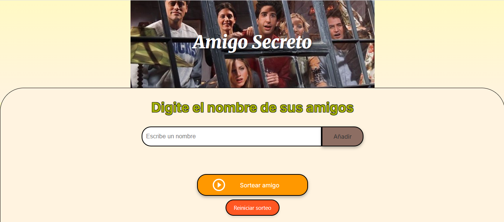
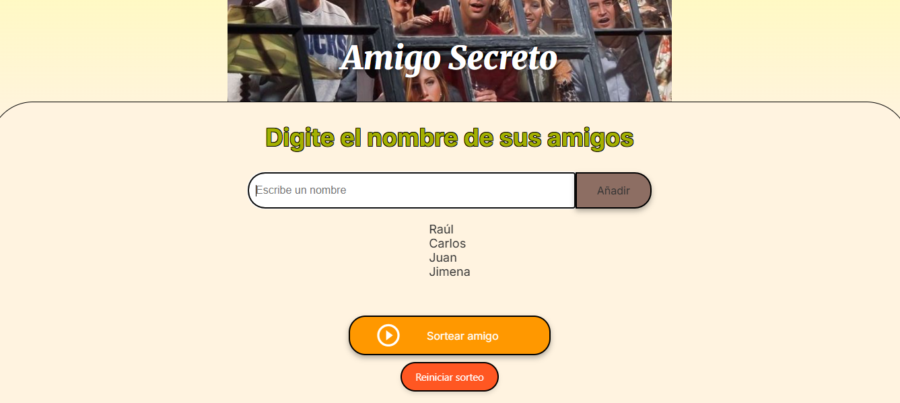
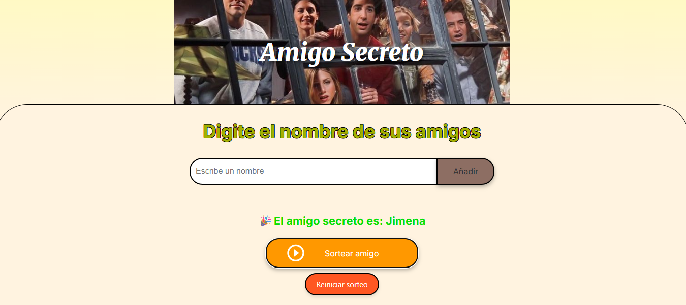

# 🎁 Amigo Secreto

Una aplicación web interactiva y visualmente amigable para organizar sorteos de amigos. Con una estética cálida y fácil de entender para el usuario.
---

## Características

-  Diseño cálido con colores amarillos y beige
-  Entrada personalizada de nombres
-  Sorteo aleatorio de amigos
-  Visualización clara de resultados
-  Botón para reiniciar el sorteo

## Vista previa 

### 🎯 Resultado del sorteo

## Tecnologías utilizadas

- HTML5
- CSS3 
- JavaScript 

## Cómo usar

1. Cloná o descargá el repositorio
2. Abrí `index.html` en tu navegador
3. Ingresá los nombres de tus amigos
4. Presioná el botón para sortear
5. Descubrí quién es el amigo secreto

## Ideas futuras

- Animaciones suaves al cargar
- Tema oscuro opcional
- Guardar nombres en localStorage

## Autor

Desarrollado con cariño por **PedroZavan**.  
Este es el primer sitio web construido 100% por mi, fue creado con dedicación, armonía visual y pensado para brindar una experiencia amigable al usuario.

## Licencia

Este proyecto es de uso libre para fines educativos y personales.
